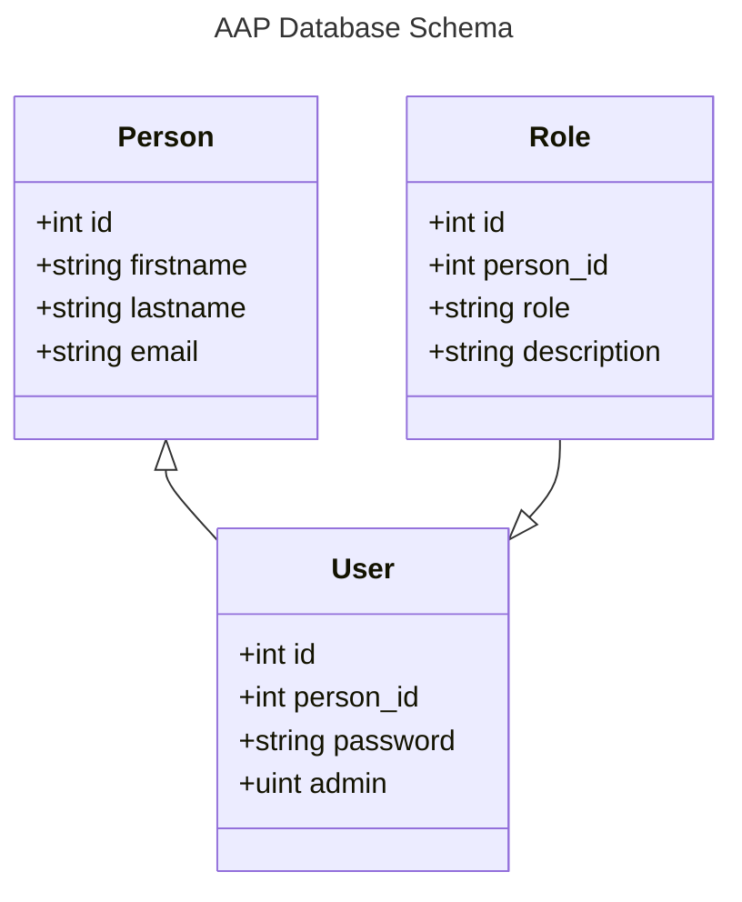

### Database Schema

```mermaid
---
title: AAP Database Schema
---
classDiagram
    Person <|-- User
    Role --|> User
    class Person {
        +int id
        +string firstname
        +string lastname
        +string email
    }
    class Role {
        +int id
        +int person_id
        +string role
        +string description
    }
    class User {
        +int id
        +int person_id
        +string password
        +uint admin
    }
```